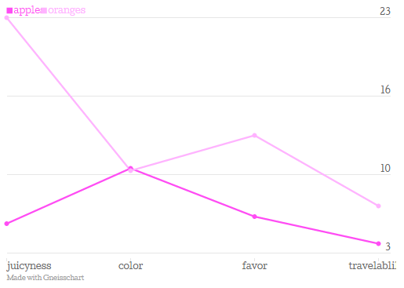
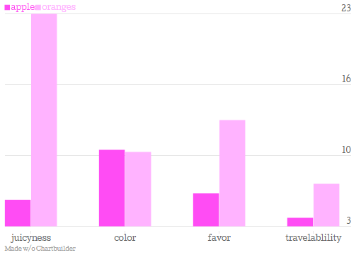

gneisschart
===========

This is an R package for drawing charts by Quartz's [Gneisschart](https://github.com/Quartz/Chartbuilder), 
powered by [htmlwidgets](https://github.com/ramnathv/htmlwidgets). 

# Disclaimer 

The original usage of Gneisschart is to export charts as PNG on some specific browser (maybe Chrome).
So, the chart generated by gneisschart is not always browser-compatible. 
Especially, IE users can't see the graph(e.g https://github.com/Quartz/Chartbuilder/issues/134).


# Installation

```r
devtools::install_github("yutannihilation/gneisschart")
```

# Example

```r
library(gneisschart)
example(gneiss)
```


